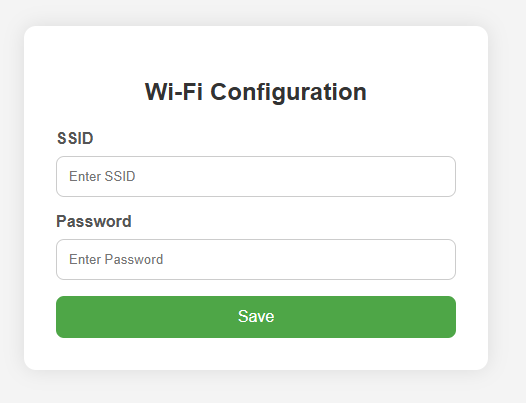
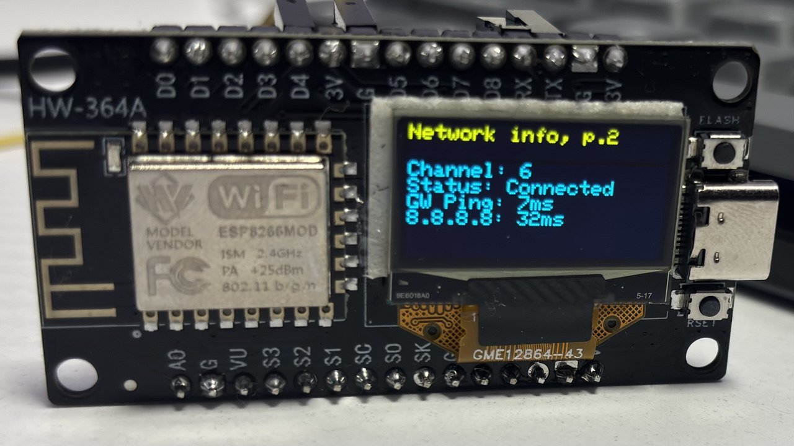

# ESP8266 Wi-Fi Monitor

## Опис

Цей проєкт дозволяє моніторити стан підключення до Wi-Fi через ESP8266. Дані відображаються на OLED-дисплеї, а конфігурація мережі задається через вебінтерфейс. Система підтримує пінг шлюзу та Google DNS (8.8.8.8), переходить у deep sleep для енергозбереження, а також дозволяє скидання налаштувань через кнопку.

## Особливості

- OLED-дисплей 128x64 для виводу інформації про Wi-Fi
- Вебінтерфейс налаштування SSID та паролю
- Збереження конфігурації в LittleFS
- Автоматичний AP-режим при відсутності конфігурації
- Перехід у deep sleep через 60 сек бездіяльності
- Кнопка для перегортання екранів або скидання налаштувань (довге натискання)
- Пінг шлюзу та Google

## Підключення

| Компонент        | Пін ESP8266 | Примітка                |
|------------------|-------------|-------------------------|
| OLED SDA         | D5 (GPIO14) |                         |
| OLED SCL         | D6 (GPIO12) |                         |
| OLED адреса      | 0x3C        | Стандартна I2C адреса   |
| Кнопка           | D4 (GPIO2)  | З підключенням до GND   |

## Залежності

Проєкт потребує наступних бібліотек:

- `Adafruit_SSD1306`
- `ESP8266WiFi`
- `ESP8266WebServer`
- `ESP8266Ping`
- `LittleFS`
- `ArduinoJson`

У PlatformIO додайте в `platformio.ini`:
```ini
lib_deps =
  adafruit/Adafruit SSD1306
  ESP8266WiFi
  ESP8266WebServer
  ESP8266Ping
  LittleFS
  bblanchon/ArduinoJson
```

## Налаштування Wi-Fi

1. При першому запуску або після скидання конфігурації ESP8266 створить точку доступу:
   - SSID: `HW-364A`
   - Пароль: `1234567890`
2. Підключіться до цієї мережі з комп’ютера або смартфона.
3. Відкрийте браузер і перейдіть за адресою: `http://192.168.4.1`
4. Введіть SSID і пароль вашої Wi-Fi мережі у форму та натисніть `Save`.
5. Після збереження пристрій перезавантажиться та спробує підключитися до вашої мережі.

## OLED-інтерфейс

На дисплеї є 2 сторінки інформації:

- **Сторінка 1:**
  ```
  SSID
  BSSID
  Gateway IP
  RSSI
  ```

- **Сторінка 2:**
  ```
  WiFi Status (Connected/Disconnected)
  Channel
  Gateway ping (ms)
  8.8.8.8 ping (ms)
  ```

Натисніть кнопку для перемикання між сторінками.

## Скидання конфігурації

- **Довге натискання кнопки (≥3 сек)**:
  - Видаляє `/config.json` з LittleFS
  - Перезапускає ESP
  - Після чого знову відкривається режим налаштування через Wi-Fi AP

## Енергозбереження

- Через 60 секунд бездіяльності (відсутність взаємодії з кнопкою/вебінтерфейсом) пристрій переходить у режим **deep sleep**, доки не буде перезавантажений (наприклад, через ресет або подачу живлення).

## Файлова система

Конфігурація зберігається у файлі `/config.json` у LittleFS. Для перевірки вмісту або ручного редагування скористайтесь серіальним монітором, OTA або змонтуйте файлову систему через PlatformIO/Arduino IDE.

## Скріншоти

### Головна сторінка вебінтерфейсу


### OLED-дисплей з інформацією


## Примітки розробнику

- Режим вебсервера активний тільки у випадку відсутності збереженої конфігурації.
- Пінг виконується кожні 5 секунд, результати оновлюються динамічно.
- Оновлення сторінок OLED відбувається при натисканні кнопки.

## Ліцензія

Цей проєкт реалізовано для ознайомлення та хобі-розробки. Вільно використовуйте, змінюйте та вдосконалюйте.
